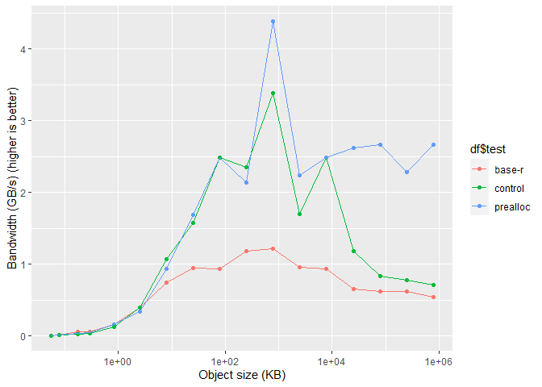
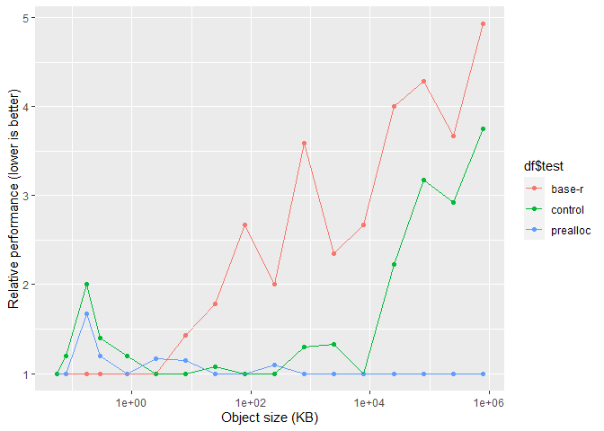

# Experiment: Preallocate buffers in base-R serialization

This is a test implementation of R’s serialization memory buffers, that
uses `object.size` to preallocate some memory.

R-base serialize needs a lot of re-allocations with larger data:

    invisible(
      serializeprealloc::serialize_prealloc(runif(1000000), prealloc = FALSE, trace = TRUE)
    )

    ## serialize_prealloc() object_size: 8000048
    ## resize_buffer() size: 0 count: 0 needed: 2 new size: 8192
    ## resize_buffer() size: 8192 count: 31 needed: 64799 new size: 131072
    ## resize_buffer() size: 131072 count: 129567 needed: 194335 new size: 393216
    ## resize_buffer() size: 393216 count: 388639 needed: 453407 new size: 909312
    ## resize_buffer() size: 909312 count: 906783 needed: 971551 new size: 1949696
    ## resize_buffer() size: 1949696 count: 1943071 needed: 2007839 new size: 4022272
    ## resize_buffer() size: 4022272 count: 4015647 needed: 4080415 new size: 8167424

## Benchmarks

    ben <- function(object, num_reps) {
      df <- rbenchmark::benchmark(
        "base-r" = {
          base::serialize(object, NULL)
        },
        "prealloc" = {
          serializeprealloc::serialize_prealloc(object)
        },
        "control" = {
          serializeprealloc::serialize_prealloc(object, prealloc = FALSE)
        },
        replications = num_reps,
        order = "elapsed"
      )
      
      os <- object.size(object)
      df$object_size_kb <- os / 1024
      df$bandwidth_gbps <-
        os * num_reps / 1024 ^ 3 / df$elapsed
      df
    }

    df <- do.call(rbind, lapply(seq(0, 8, by = 0.5), function(i) {
      
      nreps <- if (i < 4) 10000 else if (i < 6) 1000 else if (i < 8) 10 else 1

      ben(runif(10^i), num_reps = nreps)
    }))

    df |> knitr::kable(row.names = F)

<table>
<colgroup>
<col style="width: 8%" />
<col style="width: 11%" />
<col style="width: 7%" />
<col style="width: 8%" />
<col style="width: 9%" />
<col style="width: 8%" />
<col style="width: 10%" />
<col style="width: 9%" />
<col style="width: 13%" />
<col style="width: 13%" />
</colgroup>
<thead>
<tr class="header">
<th style="text-align: left;">test</th>
<th style="text-align: right;">replications</th>
<th style="text-align: right;">elapsed</th>
<th style="text-align: right;">relative</th>
<th style="text-align: right;">user.self</th>
<th style="text-align: right;">sys.self</th>
<th style="text-align: right;">user.child</th>
<th style="text-align: right;">sys.child</th>
<th style="text-align: right;">object_size_kb</th>
<th style="text-align: right;">bandwidth_gbps</th>
</tr>
</thead>
<tbody>
<tr class="odd">
<td style="text-align: left;">base-r</td>
<td style="text-align: right;">10000</td>
<td style="text-align: right;">0.06</td>
<td style="text-align: right;">1.000</td>
<td style="text-align: right;">0.03</td>
<td style="text-align: right;">0.03</td>
<td style="text-align: right;">NA</td>
<td style="text-align: right;">NA</td>
<td style="text-align: right;">5.468750e-02</td>
<td style="text-align: right;">0.0086923</td>
</tr>
<tr class="even">
<td style="text-align: left;">prealloc</td>
<td style="text-align: right;">10000</td>
<td style="text-align: right;">0.06</td>
<td style="text-align: right;">1.000</td>
<td style="text-align: right;">0.04</td>
<td style="text-align: right;">0.01</td>
<td style="text-align: right;">NA</td>
<td style="text-align: right;">NA</td>
<td style="text-align: right;">5.468750e-02</td>
<td style="text-align: right;">0.0086923</td>
</tr>
<tr class="odd">
<td style="text-align: left;">control</td>
<td style="text-align: right;">10000</td>
<td style="text-align: right;">0.06</td>
<td style="text-align: right;">1.000</td>
<td style="text-align: right;">0.04</td>
<td style="text-align: right;">0.02</td>
<td style="text-align: right;">NA</td>
<td style="text-align: right;">NA</td>
<td style="text-align: right;">5.468750e-02</td>
<td style="text-align: right;">0.0086923</td>
</tr>
<tr class="even">
<td style="text-align: left;">base-r</td>
<td style="text-align: right;">10000</td>
<td style="text-align: right;">0.05</td>
<td style="text-align: right;">1.000</td>
<td style="text-align: right;">0.04</td>
<td style="text-align: right;">0.01</td>
<td style="text-align: right;">NA</td>
<td style="text-align: right;">NA</td>
<td style="text-align: right;">7.812500e-02</td>
<td style="text-align: right;">0.0149012</td>
</tr>
<tr class="odd">
<td style="text-align: left;">prealloc</td>
<td style="text-align: right;">10000</td>
<td style="text-align: right;">0.05</td>
<td style="text-align: right;">1.000</td>
<td style="text-align: right;">0.03</td>
<td style="text-align: right;">0.01</td>
<td style="text-align: right;">NA</td>
<td style="text-align: right;">NA</td>
<td style="text-align: right;">7.812500e-02</td>
<td style="text-align: right;">0.0149012</td>
</tr>
<tr class="even">
<td style="text-align: left;">control</td>
<td style="text-align: right;">10000</td>
<td style="text-align: right;">0.06</td>
<td style="text-align: right;">1.200</td>
<td style="text-align: right;">0.04</td>
<td style="text-align: right;">0.02</td>
<td style="text-align: right;">NA</td>
<td style="text-align: right;">NA</td>
<td style="text-align: right;">7.812500e-02</td>
<td style="text-align: right;">0.0124176</td>
</tr>
<tr class="odd">
<td style="text-align: left;">base-r</td>
<td style="text-align: right;">10000</td>
<td style="text-align: right;">0.03</td>
<td style="text-align: right;">1.000</td>
<td style="text-align: right;">0.03</td>
<td style="text-align: right;">0.00</td>
<td style="text-align: right;">NA</td>
<td style="text-align: right;">NA</td>
<td style="text-align: right;">1.718750e-01</td>
<td style="text-align: right;">0.0546376</td>
</tr>
<tr class="even">
<td style="text-align: left;">prealloc</td>
<td style="text-align: right;">10000</td>
<td style="text-align: right;">0.05</td>
<td style="text-align: right;">1.667</td>
<td style="text-align: right;">0.04</td>
<td style="text-align: right;">0.00</td>
<td style="text-align: right;">NA</td>
<td style="text-align: right;">NA</td>
<td style="text-align: right;">1.718750e-01</td>
<td style="text-align: right;">0.0327826</td>
</tr>
<tr class="odd">
<td style="text-align: left;">control</td>
<td style="text-align: right;">10000</td>
<td style="text-align: right;">0.06</td>
<td style="text-align: right;">2.000</td>
<td style="text-align: right;">0.05</td>
<td style="text-align: right;">0.02</td>
<td style="text-align: right;">NA</td>
<td style="text-align: right;">NA</td>
<td style="text-align: right;">1.718750e-01</td>
<td style="text-align: right;">0.0273188</td>
</tr>
<tr class="even">
<td style="text-align: left;">base-r</td>
<td style="text-align: right;">10000</td>
<td style="text-align: right;">0.05</td>
<td style="text-align: right;">1.000</td>
<td style="text-align: right;">0.05</td>
<td style="text-align: right;">0.00</td>
<td style="text-align: right;">NA</td>
<td style="text-align: right;">NA</td>
<td style="text-align: right;">2.890625e-01</td>
<td style="text-align: right;">0.0551343</td>
</tr>
<tr class="odd">
<td style="text-align: left;">prealloc</td>
<td style="text-align: right;">10000</td>
<td style="text-align: right;">0.06</td>
<td style="text-align: right;">1.200</td>
<td style="text-align: right;">0.05</td>
<td style="text-align: right;">0.02</td>
<td style="text-align: right;">NA</td>
<td style="text-align: right;">NA</td>
<td style="text-align: right;">2.890625e-01</td>
<td style="text-align: right;">0.0459452</td>
</tr>
<tr class="even">
<td style="text-align: left;">control</td>
<td style="text-align: right;">10000</td>
<td style="text-align: right;">0.07</td>
<td style="text-align: right;">1.400</td>
<td style="text-align: right;">0.06</td>
<td style="text-align: right;">0.00</td>
<td style="text-align: right;">NA</td>
<td style="text-align: right;">NA</td>
<td style="text-align: right;">2.890625e-01</td>
<td style="text-align: right;">0.0393816</td>
</tr>
<tr class="odd">
<td style="text-align: left;">base-r</td>
<td style="text-align: right;">10000</td>
<td style="text-align: right;">0.05</td>
<td style="text-align: right;">1.000</td>
<td style="text-align: right;">0.05</td>
<td style="text-align: right;">0.00</td>
<td style="text-align: right;">NA</td>
<td style="text-align: right;">NA</td>
<td style="text-align: right;">8.281250e-01</td>
<td style="text-align: right;">0.1579523</td>
</tr>
<tr class="even">
<td style="text-align: left;">prealloc</td>
<td style="text-align: right;">10000</td>
<td style="text-align: right;">0.05</td>
<td style="text-align: right;">1.000</td>
<td style="text-align: right;">0.03</td>
<td style="text-align: right;">0.01</td>
<td style="text-align: right;">NA</td>
<td style="text-align: right;">NA</td>
<td style="text-align: right;">8.281250e-01</td>
<td style="text-align: right;">0.1579523</td>
</tr>
<tr class="odd">
<td style="text-align: left;">control</td>
<td style="text-align: right;">10000</td>
<td style="text-align: right;">0.06</td>
<td style="text-align: right;">1.200</td>
<td style="text-align: right;">0.06</td>
<td style="text-align: right;">0.00</td>
<td style="text-align: right;">NA</td>
<td style="text-align: right;">NA</td>
<td style="text-align: right;">8.281250e-01</td>
<td style="text-align: right;">0.1316269</td>
</tr>
<tr class="even">
<td style="text-align: left;">base-r</td>
<td style="text-align: right;">10000</td>
<td style="text-align: right;">0.06</td>
<td style="text-align: right;">1.000</td>
<td style="text-align: right;">0.06</td>
<td style="text-align: right;">0.00</td>
<td style="text-align: right;">NA</td>
<td style="text-align: right;">NA</td>
<td style="text-align: right;">2.515625e+00</td>
<td style="text-align: right;">0.3998478</td>
</tr>
<tr class="odd">
<td style="text-align: left;">control</td>
<td style="text-align: right;">10000</td>
<td style="text-align: right;">0.06</td>
<td style="text-align: right;">1.000</td>
<td style="text-align: right;">0.05</td>
<td style="text-align: right;">0.02</td>
<td style="text-align: right;">NA</td>
<td style="text-align: right;">NA</td>
<td style="text-align: right;">2.515625e+00</td>
<td style="text-align: right;">0.3998478</td>
</tr>
<tr class="even">
<td style="text-align: left;">prealloc</td>
<td style="text-align: right;">10000</td>
<td style="text-align: right;">0.07</td>
<td style="text-align: right;">1.167</td>
<td style="text-align: right;">0.08</td>
<td style="text-align: right;">0.00</td>
<td style="text-align: right;">NA</td>
<td style="text-align: right;">NA</td>
<td style="text-align: right;">2.515625e+00</td>
<td style="text-align: right;">0.3427267</td>
</tr>
<tr class="odd">
<td style="text-align: left;">control</td>
<td style="text-align: right;">10000</td>
<td style="text-align: right;">0.07</td>
<td style="text-align: right;">1.000</td>
<td style="text-align: right;">0.06</td>
<td style="text-align: right;">0.01</td>
<td style="text-align: right;">NA</td>
<td style="text-align: right;">NA</td>
<td style="text-align: right;">7.859375e+00</td>
<td style="text-align: right;">1.0707549</td>
</tr>
<tr class="even">
<td style="text-align: left;">prealloc</td>
<td style="text-align: right;">10000</td>
<td style="text-align: right;">0.08</td>
<td style="text-align: right;">1.143</td>
<td style="text-align: right;">0.07</td>
<td style="text-align: right;">0.02</td>
<td style="text-align: right;">NA</td>
<td style="text-align: right;">NA</td>
<td style="text-align: right;">7.859375e+00</td>
<td style="text-align: right;">0.9369105</td>
</tr>
<tr class="odd">
<td style="text-align: left;">base-r</td>
<td style="text-align: right;">10000</td>
<td style="text-align: right;">0.10</td>
<td style="text-align: right;">1.429</td>
<td style="text-align: right;">0.08</td>
<td style="text-align: right;">0.01</td>
<td style="text-align: right;">NA</td>
<td style="text-align: right;">NA</td>
<td style="text-align: right;">7.859375e+00</td>
<td style="text-align: right;">0.7495284</td>
</tr>
<tr class="even">
<td style="text-align: left;">prealloc</td>
<td style="text-align: right;">10000</td>
<td style="text-align: right;">0.14</td>
<td style="text-align: right;">1.000</td>
<td style="text-align: right;">0.07</td>
<td style="text-align: right;">0.08</td>
<td style="text-align: right;">NA</td>
<td style="text-align: right;">NA</td>
<td style="text-align: right;">2.475000e+01</td>
<td style="text-align: right;">1.6859600</td>
</tr>
<tr class="odd">
<td style="text-align: left;">control</td>
<td style="text-align: right;">10000</td>
<td style="text-align: right;">0.15</td>
<td style="text-align: right;">1.071</td>
<td style="text-align: right;">0.08</td>
<td style="text-align: right;">0.08</td>
<td style="text-align: right;">NA</td>
<td style="text-align: right;">NA</td>
<td style="text-align: right;">2.475000e+01</td>
<td style="text-align: right;">1.5735626</td>
</tr>
<tr class="even">
<td style="text-align: left;">base-r</td>
<td style="text-align: right;">10000</td>
<td style="text-align: right;">0.25</td>
<td style="text-align: right;">1.786</td>
<td style="text-align: right;">0.17</td>
<td style="text-align: right;">0.08</td>
<td style="text-align: right;">NA</td>
<td style="text-align: right;">NA</td>
<td style="text-align: right;">2.475000e+01</td>
<td style="text-align: right;">0.9441376</td>
</tr>
<tr class="odd">
<td style="text-align: left;">prealloc</td>
<td style="text-align: right;">1000</td>
<td style="text-align: right;">0.03</td>
<td style="text-align: right;">1.000</td>
<td style="text-align: right;">0.00</td>
<td style="text-align: right;">0.03</td>
<td style="text-align: right;">NA</td>
<td style="text-align: right;">NA</td>
<td style="text-align: right;">7.817188e+01</td>
<td style="text-align: right;">2.4850170</td>
</tr>
<tr class="even">
<td style="text-align: left;">control</td>
<td style="text-align: right;">1000</td>
<td style="text-align: right;">0.03</td>
<td style="text-align: right;">1.000</td>
<td style="text-align: right;">0.00</td>
<td style="text-align: right;">0.04</td>
<td style="text-align: right;">NA</td>
<td style="text-align: right;">NA</td>
<td style="text-align: right;">7.817188e+01</td>
<td style="text-align: right;">2.4850170</td>
</tr>
<tr class="odd">
<td style="text-align: left;">base-r</td>
<td style="text-align: right;">1000</td>
<td style="text-align: right;">0.08</td>
<td style="text-align: right;">2.667</td>
<td style="text-align: right;">0.07</td>
<td style="text-align: right;">0.01</td>
<td style="text-align: right;">NA</td>
<td style="text-align: right;">NA</td>
<td style="text-align: right;">7.817188e+01</td>
<td style="text-align: right;">0.9318814</td>
</tr>
<tr class="even">
<td style="text-align: left;">control</td>
<td style="text-align: right;">1000</td>
<td style="text-align: right;">0.10</td>
<td style="text-align: right;">1.000</td>
<td style="text-align: right;">0.00</td>
<td style="text-align: right;">0.09</td>
<td style="text-align: right;">NA</td>
<td style="text-align: right;">NA</td>
<td style="text-align: right;">2.470938e+02</td>
<td style="text-align: right;">2.3564696</td>
</tr>
<tr class="odd">
<td style="text-align: left;">prealloc</td>
<td style="text-align: right;">1000</td>
<td style="text-align: right;">0.11</td>
<td style="text-align: right;">1.100</td>
<td style="text-align: right;">0.05</td>
<td style="text-align: right;">0.06</td>
<td style="text-align: right;">NA</td>
<td style="text-align: right;">NA</td>
<td style="text-align: right;">2.470938e+02</td>
<td style="text-align: right;">2.1422451</td>
</tr>
<tr class="even">
<td style="text-align: left;">base-r</td>
<td style="text-align: right;">1000</td>
<td style="text-align: right;">0.20</td>
<td style="text-align: right;">2.000</td>
<td style="text-align: right;">0.14</td>
<td style="text-align: right;">0.06</td>
<td style="text-align: right;">NA</td>
<td style="text-align: right;">NA</td>
<td style="text-align: right;">2.470938e+02</td>
<td style="text-align: right;">1.1782348</td>
</tr>
<tr class="odd">
<td style="text-align: left;">prealloc</td>
<td style="text-align: right;">1000</td>
<td style="text-align: right;">0.17</td>
<td style="text-align: right;">1.000</td>
<td style="text-align: right;">0.10</td>
<td style="text-align: right;">0.08</td>
<td style="text-align: right;">NA</td>
<td style="text-align: right;">NA</td>
<td style="text-align: right;">7.812969e+02</td>
<td style="text-align: right;">4.3829574</td>
</tr>
<tr class="even">
<td style="text-align: left;">control</td>
<td style="text-align: right;">1000</td>
<td style="text-align: right;">0.22</td>
<td style="text-align: right;">1.294</td>
<td style="text-align: right;">0.08</td>
<td style="text-align: right;">0.14</td>
<td style="text-align: right;">NA</td>
<td style="text-align: right;">NA</td>
<td style="text-align: right;">7.812969e+02</td>
<td style="text-align: right;">3.3868307</td>
</tr>
<tr class="odd">
<td style="text-align: left;">base-r</td>
<td style="text-align: right;">1000</td>
<td style="text-align: right;">0.61</td>
<td style="text-align: right;">3.588</td>
<td style="text-align: right;">0.45</td>
<td style="text-align: right;">0.16</td>
<td style="text-align: right;">NA</td>
<td style="text-align: right;">NA</td>
<td style="text-align: right;">7.812969e+02</td>
<td style="text-align: right;">1.2214799</td>
</tr>
<tr class="even">
<td style="text-align: left;">prealloc</td>
<td style="text-align: right;">1000</td>
<td style="text-align: right;">1.05</td>
<td style="text-align: right;">1.000</td>
<td style="text-align: right;">0.68</td>
<td style="text-align: right;">0.38</td>
<td style="text-align: right;">NA</td>
<td style="text-align: right;">NA</td>
<td style="text-align: right;">2.470570e+03</td>
<td style="text-align: right;">2.2439233</td>
</tr>
<tr class="odd">
<td style="text-align: left;">control</td>
<td style="text-align: right;">1000</td>
<td style="text-align: right;">1.39</td>
<td style="text-align: right;">1.324</td>
<td style="text-align: right;">0.92</td>
<td style="text-align: right;">0.46</td>
<td style="text-align: right;">NA</td>
<td style="text-align: right;">NA</td>
<td style="text-align: right;">2.470570e+03</td>
<td style="text-align: right;">1.6950500</td>
</tr>
<tr class="even">
<td style="text-align: left;">base-r</td>
<td style="text-align: right;">1000</td>
<td style="text-align: right;">2.47</td>
<td style="text-align: right;">2.352</td>
<td style="text-align: right;">1.92</td>
<td style="text-align: right;">0.51</td>
<td style="text-align: right;">NA</td>
<td style="text-align: right;">NA</td>
<td style="text-align: right;">2.470570e+03</td>
<td style="text-align: right;">0.9538945</td>
</tr>
<tr class="odd">
<td style="text-align: left;">control</td>
<td style="text-align: right;">10</td>
<td style="text-align: right;">0.03</td>
<td style="text-align: right;">1.000</td>
<td style="text-align: right;">0.00</td>
<td style="text-align: right;">0.03</td>
<td style="text-align: right;">NA</td>
<td style="text-align: right;">NA</td>
<td style="text-align: right;">7.812547e+03</td>
<td style="text-align: right;">2.4835418</td>
</tr>
<tr class="even">
<td style="text-align: left;">prealloc</td>
<td style="text-align: right;">10</td>
<td style="text-align: right;">0.03</td>
<td style="text-align: right;">1.000</td>
<td style="text-align: right;">0.02</td>
<td style="text-align: right;">0.02</td>
<td style="text-align: right;">NA</td>
<td style="text-align: right;">NA</td>
<td style="text-align: right;">7.812547e+03</td>
<td style="text-align: right;">2.4835418</td>
</tr>
<tr class="odd">
<td style="text-align: left;">base-r</td>
<td style="text-align: right;">10</td>
<td style="text-align: right;">0.08</td>
<td style="text-align: right;">2.667</td>
<td style="text-align: right;">0.03</td>
<td style="text-align: right;">0.05</td>
<td style="text-align: right;">NA</td>
<td style="text-align: right;">NA</td>
<td style="text-align: right;">7.812547e+03</td>
<td style="text-align: right;">0.9313282</td>
</tr>
<tr class="even">
<td style="text-align: left;">prealloc</td>
<td style="text-align: right;">10</td>
<td style="text-align: right;">0.09</td>
<td style="text-align: right;">1.000</td>
<td style="text-align: right;">0.08</td>
<td style="text-align: right;">0.01</td>
<td style="text-align: right;">NA</td>
<td style="text-align: right;">NA</td>
<td style="text-align: right;">2.470534e+04</td>
<td style="text-align: right;">2.6178716</td>
</tr>
<tr class="odd">
<td style="text-align: left;">control</td>
<td style="text-align: right;">10</td>
<td style="text-align: right;">0.20</td>
<td style="text-align: right;">2.222</td>
<td style="text-align: right;">0.12</td>
<td style="text-align: right;">0.08</td>
<td style="text-align: right;">NA</td>
<td style="text-align: right;">NA</td>
<td style="text-align: right;">2.470534e+04</td>
<td style="text-align: right;">1.1780422</td>
</tr>
<tr class="even">
<td style="text-align: left;">base-r</td>
<td style="text-align: right;">10</td>
<td style="text-align: right;">0.36</td>
<td style="text-align: right;">4.000</td>
<td style="text-align: right;">0.32</td>
<td style="text-align: right;">0.05</td>
<td style="text-align: right;">NA</td>
<td style="text-align: right;">NA</td>
<td style="text-align: right;">2.470534e+04</td>
<td style="text-align: right;">0.6544679</td>
</tr>
<tr class="odd">
<td style="text-align: left;">prealloc</td>
<td style="text-align: right;">10</td>
<td style="text-align: right;">0.28</td>
<td style="text-align: right;">1.000</td>
<td style="text-align: right;">0.15</td>
<td style="text-align: right;">0.14</td>
<td style="text-align: right;">NA</td>
<td style="text-align: right;">NA</td>
<td style="text-align: right;">7.812505e+04</td>
<td style="text-align: right;">2.6609232</td>
</tr>
<tr class="even">
<td style="text-align: left;">control</td>
<td style="text-align: right;">10</td>
<td style="text-align: right;">0.89</td>
<td style="text-align: right;">3.179</td>
<td style="text-align: right;">0.59</td>
<td style="text-align: right;">0.30</td>
<td style="text-align: right;">NA</td>
<td style="text-align: right;">NA</td>
<td style="text-align: right;">7.812505e+04</td>
<td style="text-align: right;">0.8371444</td>
</tr>
<tr class="odd">
<td style="text-align: left;">base-r</td>
<td style="text-align: right;">10</td>
<td style="text-align: right;">1.20</td>
<td style="text-align: right;">4.286</td>
<td style="text-align: right;">0.80</td>
<td style="text-align: right;">0.40</td>
<td style="text-align: right;">NA</td>
<td style="text-align: right;">NA</td>
<td style="text-align: right;">7.812505e+04</td>
<td style="text-align: right;">0.6208821</td>
</tr>
<tr class="even">
<td style="text-align: left;">prealloc</td>
<td style="text-align: right;">10</td>
<td style="text-align: right;">1.03</td>
<td style="text-align: right;">1.000</td>
<td style="text-align: right;">0.79</td>
<td style="text-align: right;">0.23</td>
<td style="text-align: right;">NA</td>
<td style="text-align: right;">NA</td>
<td style="text-align: right;">2.470530e+05</td>
<td style="text-align: right;">2.2874571</td>
</tr>
<tr class="odd">
<td style="text-align: left;">control</td>
<td style="text-align: right;">10</td>
<td style="text-align: right;">3.01</td>
<td style="text-align: right;">2.922</td>
<td style="text-align: right;">1.94</td>
<td style="text-align: right;">1.08</td>
<td style="text-align: right;">NA</td>
<td style="text-align: right;">NA</td>
<td style="text-align: right;">2.470530e+05</td>
<td style="text-align: right;">0.7827511</td>
</tr>
<tr class="even">
<td style="text-align: left;">base-r</td>
<td style="text-align: right;">10</td>
<td style="text-align: right;">3.78</td>
<td style="text-align: right;">3.670</td>
<td style="text-align: right;">2.75</td>
<td style="text-align: right;">1.03</td>
<td style="text-align: right;">NA</td>
<td style="text-align: right;">NA</td>
<td style="text-align: right;">2.470530e+05</td>
<td style="text-align: right;">0.6233018</td>
</tr>
<tr class="odd">
<td style="text-align: left;">prealloc</td>
<td style="text-align: right;">1</td>
<td style="text-align: right;">0.28</td>
<td style="text-align: right;">1.000</td>
<td style="text-align: right;">0.19</td>
<td style="text-align: right;">0.10</td>
<td style="text-align: right;">NA</td>
<td style="text-align: right;">NA</td>
<td style="text-align: right;">7.812500e+05</td>
<td style="text-align: right;">2.6609218</td>
</tr>
<tr class="even">
<td style="text-align: left;">control</td>
<td style="text-align: right;">1</td>
<td style="text-align: right;">1.05</td>
<td style="text-align: right;">3.750</td>
<td style="text-align: right;">0.75</td>
<td style="text-align: right;">0.30</td>
<td style="text-align: right;">NA</td>
<td style="text-align: right;">NA</td>
<td style="text-align: right;">7.812500e+05</td>
<td style="text-align: right;">0.7095791</td>
</tr>
<tr class="odd">
<td style="text-align: left;">base-r</td>
<td style="text-align: right;">1</td>
<td style="text-align: right;">1.38</td>
<td style="text-align: right;">4.929</td>
<td style="text-align: right;">1.03</td>
<td style="text-align: right;">0.35</td>
<td style="text-align: right;">NA</td>
<td style="text-align: right;">NA</td>
<td style="text-align: right;">7.812500e+05</td>
<td style="text-align: right;">0.5398972</td>
</tr>
</tbody>
</table>

    library(ggplot2)
    ggplot(df, aes(df$object_size_kb, df$bandwidth_gbps, color = df$test)) +
      labs(x = "Object size (KB)", y = "Bandwidth (GB/s) (higher is better)") +
      geom_point() +
      geom_line() +
      scale_x_log10()

    ggplot(df, aes(df$object_size_kb, df$relative, color = df$test)) +
      labs(x = "Object size (KB)", y = "Relative performance (lower is better)") +
      geom_point() +
      geom_line() +
      scale_x_log10()

Still faster using heavily nested objects:

    obj <- list()
    for (i in seq_len(20)) {
      obj <- list(obj, obj)
    }
    object.size(obj)

    ## 117440448 bytes

    ben(obj, num_reps = 100) |> knitr::kable(row.names = F)

<table>
<colgroup>
<col style="width: 8%" />
<col style="width: 11%" />
<col style="width: 7%" />
<col style="width: 8%" />
<col style="width: 9%" />
<col style="width: 8%" />
<col style="width: 10%" />
<col style="width: 9%" />
<col style="width: 13%" />
<col style="width: 13%" />
</colgroup>
<thead>
<tr class="header">
<th style="text-align: left;">test</th>
<th style="text-align: right;">replications</th>
<th style="text-align: right;">elapsed</th>
<th style="text-align: right;">relative</th>
<th style="text-align: right;">user.self</th>
<th style="text-align: right;">sys.self</th>
<th style="text-align: right;">user.child</th>
<th style="text-align: right;">sys.child</th>
<th style="text-align: right;">object_size_kb</th>
<th style="text-align: right;">bandwidth_gbps</th>
</tr>
</thead>
<tbody>
<tr class="odd">
<td style="text-align: left;">prealloc</td>
<td style="text-align: right;">100</td>
<td style="text-align: right;">4.88</td>
<td style="text-align: right;">1.000</td>
<td style="text-align: right;">4.61</td>
<td style="text-align: right;">0.27</td>
<td style="text-align: right;">NA</td>
<td style="text-align: right;">NA</td>
<td style="text-align: right;">114687.9</td>
<td style="text-align: right;">2.241290</td>
</tr>
<tr class="even">
<td style="text-align: left;">base-r</td>
<td style="text-align: right;">100</td>
<td style="text-align: right;">5.22</td>
<td style="text-align: right;">1.070</td>
<td style="text-align: right;">4.84</td>
<td style="text-align: right;">0.36</td>
<td style="text-align: right;">NA</td>
<td style="text-align: right;">NA</td>
<td style="text-align: right;">114687.9</td>
<td style="text-align: right;">2.095305</td>
</tr>
<tr class="odd">
<td style="text-align: left;">control</td>
<td style="text-align: right;">100</td>
<td style="text-align: right;">5.35</td>
<td style="text-align: right;">1.096</td>
<td style="text-align: right;">4.81</td>
<td style="text-align: right;">0.49</td>
<td style="text-align: right;">NA</td>
<td style="text-align: right;">NA</td>
<td style="text-align: right;">114687.9</td>
<td style="text-align: right;">2.044391</td>
</tr>
</tbody>
</table>
