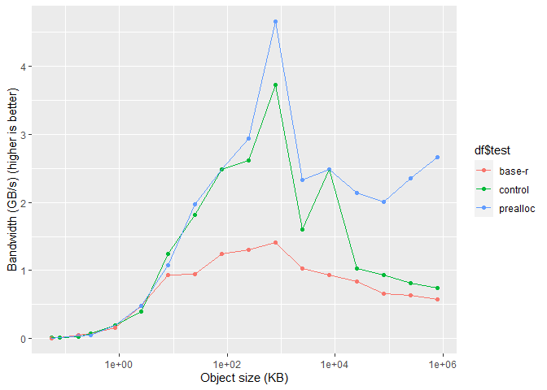
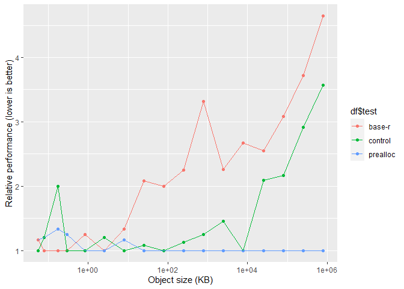

# Experiment: Preallocate buffers in base-R serialization

This is a test implementation of R’s serialization memory buffers, that
uses `object.size` to preallocate memory buffers.

R-base serialize needs a lot of re-allocations with larger data:

    set.seed(pi)

    invisible(
      serializeprealloc::serialize_prealloc(runif(1000000), prealloc = FALSE, trace = TRUE)
    )

    ## serialize_prealloc() object_size: 8000048
    ## resize_buffer() size: 0 count: 0 needed: 2 new size: 8192
    ## resize_buffer() size: 8192 count: 31 needed: 64799 new size: 131072
    ## resize_buffer() size: 131072 count: 129567 needed: 194335 new size: 393216
    ## resize_buffer() size: 393216 count: 388639 needed: 453407 new size: 909312
    ## resize_buffer() size: 909312 count: 906783 needed: 971551 new size: 1949696
    ## resize_buffer() size: 1949696 count: 1943071 needed: 2007839 new size: 4022272
    ## resize_buffer() size: 4022272 count: 4015647 needed: 4080415 new size: 8167424

## Benchmarks

    ben <- function(object, num_reps) {
      df <- rbenchmark::benchmark(
        "base-r" = {
          base::serialize(object, NULL)
        },
        "prealloc" = {
          serializeprealloc::serialize_prealloc(object)
        },
        "control" = {
          serializeprealloc::serialize_prealloc(object, prealloc = FALSE)
        },
        replications = num_reps,
        order = "elapsed"
      )
      
      os <- object.size(object)
      df$object_size_kb <- os / 1024
      df$bandwidth_gbps <-
        os * num_reps / 1024 ^ 3 / df$elapsed
      df
    }

This benchmark tests a variety of object sizes (numeric vectors of size
1 to 10^8)

    df <- do.call(rbind, lapply(seq(0, 8, by = 0.5), function(i) {
      
      nreps <- if (i < 4) 10000 else if (i < 6) 1000 else if (i < 8) 10 else 1

      ben(runif(10^i), num_reps = nreps)
    }))

Output dataframe (long)

    df |> knitr::kable(row.names = F)

<table>
<colgroup>
<col style="width: 8%" />
<col style="width: 11%" />
<col style="width: 7%" />
<col style="width: 8%" />
<col style="width: 9%" />
<col style="width: 8%" />
<col style="width: 10%" />
<col style="width: 9%" />
<col style="width: 13%" />
<col style="width: 13%" />
</colgroup>
<thead>
<tr class="header">
<th style="text-align: left;">test</th>
<th style="text-align: right;">replications</th>
<th style="text-align: right;">elapsed</th>
<th style="text-align: right;">relative</th>
<th style="text-align: right;">user.self</th>
<th style="text-align: right;">sys.self</th>
<th style="text-align: right;">user.child</th>
<th style="text-align: right;">sys.child</th>
<th style="text-align: right;">object_size_kb</th>
<th style="text-align: right;">bandwidth_gbps</th>
</tr>
</thead>
<tbody>
<tr class="odd">
<td style="text-align: left;">control</td>
<td style="text-align: right;">10000</td>
<td style="text-align: right;">0.06</td>
<td style="text-align: right;">1.000</td>
<td style="text-align: right;">0.06</td>
<td style="text-align: right;">0.00</td>
<td style="text-align: right;">NA</td>
<td style="text-align: right;">NA</td>
<td style="text-align: right;">5.468750e-02</td>
<td style="text-align: right;">0.0086923</td>
</tr>
<tr class="even">
<td style="text-align: left;">prealloc</td>
<td style="text-align: right;">10000</td>
<td style="text-align: right;">0.07</td>
<td style="text-align: right;">1.167</td>
<td style="text-align: right;">0.05</td>
<td style="text-align: right;">0.01</td>
<td style="text-align: right;">NA</td>
<td style="text-align: right;">NA</td>
<td style="text-align: right;">5.468750e-02</td>
<td style="text-align: right;">0.0074506</td>
</tr>
<tr class="odd">
<td style="text-align: left;">base-r</td>
<td style="text-align: right;">10000</td>
<td style="text-align: right;">0.07</td>
<td style="text-align: right;">1.167</td>
<td style="text-align: right;">0.02</td>
<td style="text-align: right;">0.05</td>
<td style="text-align: right;">NA</td>
<td style="text-align: right;">NA</td>
<td style="text-align: right;">5.468750e-02</td>
<td style="text-align: right;">0.0074506</td>
</tr>
<tr class="even">
<td style="text-align: left;">base-r</td>
<td style="text-align: right;">10000</td>
<td style="text-align: right;">0.05</td>
<td style="text-align: right;">1.000</td>
<td style="text-align: right;">0.05</td>
<td style="text-align: right;">0.00</td>
<td style="text-align: right;">NA</td>
<td style="text-align: right;">NA</td>
<td style="text-align: right;">7.812500e-02</td>
<td style="text-align: right;">0.0149012</td>
</tr>
<tr class="odd">
<td style="text-align: left;">prealloc</td>
<td style="text-align: right;">10000</td>
<td style="text-align: right;">0.06</td>
<td style="text-align: right;">1.200</td>
<td style="text-align: right;">0.05</td>
<td style="text-align: right;">0.02</td>
<td style="text-align: right;">NA</td>
<td style="text-align: right;">NA</td>
<td style="text-align: right;">7.812500e-02</td>
<td style="text-align: right;">0.0124176</td>
</tr>
<tr class="even">
<td style="text-align: left;">control</td>
<td style="text-align: right;">10000</td>
<td style="text-align: right;">0.06</td>
<td style="text-align: right;">1.200</td>
<td style="text-align: right;">0.06</td>
<td style="text-align: right;">0.00</td>
<td style="text-align: right;">NA</td>
<td style="text-align: right;">NA</td>
<td style="text-align: right;">7.812500e-02</td>
<td style="text-align: right;">0.0124176</td>
</tr>
<tr class="odd">
<td style="text-align: left;">base-r</td>
<td style="text-align: right;">10000</td>
<td style="text-align: right;">0.03</td>
<td style="text-align: right;">1.000</td>
<td style="text-align: right;">0.04</td>
<td style="text-align: right;">0.00</td>
<td style="text-align: right;">NA</td>
<td style="text-align: right;">NA</td>
<td style="text-align: right;">1.718750e-01</td>
<td style="text-align: right;">0.0546376</td>
</tr>
<tr class="even">
<td style="text-align: left;">prealloc</td>
<td style="text-align: right;">10000</td>
<td style="text-align: right;">0.04</td>
<td style="text-align: right;">1.333</td>
<td style="text-align: right;">0.03</td>
<td style="text-align: right;">0.02</td>
<td style="text-align: right;">NA</td>
<td style="text-align: right;">NA</td>
<td style="text-align: right;">1.718750e-01</td>
<td style="text-align: right;">0.0409782</td>
</tr>
<tr class="odd">
<td style="text-align: left;">control</td>
<td style="text-align: right;">10000</td>
<td style="text-align: right;">0.06</td>
<td style="text-align: right;">2.000</td>
<td style="text-align: right;">0.06</td>
<td style="text-align: right;">0.00</td>
<td style="text-align: right;">NA</td>
<td style="text-align: right;">NA</td>
<td style="text-align: right;">1.718750e-01</td>
<td style="text-align: right;">0.0273188</td>
</tr>
<tr class="even">
<td style="text-align: left;">base-r</td>
<td style="text-align: right;">10000</td>
<td style="text-align: right;">0.04</td>
<td style="text-align: right;">1.000</td>
<td style="text-align: right;">0.04</td>
<td style="text-align: right;">0.00</td>
<td style="text-align: right;">NA</td>
<td style="text-align: right;">NA</td>
<td style="text-align: right;">2.890625e-01</td>
<td style="text-align: right;">0.0689179</td>
</tr>
<tr class="odd">
<td style="text-align: left;">control</td>
<td style="text-align: right;">10000</td>
<td style="text-align: right;">0.04</td>
<td style="text-align: right;">1.000</td>
<td style="text-align: right;">0.03</td>
<td style="text-align: right;">0.02</td>
<td style="text-align: right;">NA</td>
<td style="text-align: right;">NA</td>
<td style="text-align: right;">2.890625e-01</td>
<td style="text-align: right;">0.0689179</td>
</tr>
<tr class="even">
<td style="text-align: left;">prealloc</td>
<td style="text-align: right;">10000</td>
<td style="text-align: right;">0.05</td>
<td style="text-align: right;">1.250</td>
<td style="text-align: right;">0.05</td>
<td style="text-align: right;">0.00</td>
<td style="text-align: right;">NA</td>
<td style="text-align: right;">NA</td>
<td style="text-align: right;">2.890625e-01</td>
<td style="text-align: right;">0.0551343</td>
</tr>
<tr class="odd">
<td style="text-align: left;">prealloc</td>
<td style="text-align: right;">10000</td>
<td style="text-align: right;">0.04</td>
<td style="text-align: right;">1.000</td>
<td style="text-align: right;">0.03</td>
<td style="text-align: right;">0.02</td>
<td style="text-align: right;">NA</td>
<td style="text-align: right;">NA</td>
<td style="text-align: right;">8.281250e-01</td>
<td style="text-align: right;">0.1974404</td>
</tr>
<tr class="even">
<td style="text-align: left;">control</td>
<td style="text-align: right;">10000</td>
<td style="text-align: right;">0.04</td>
<td style="text-align: right;">1.000</td>
<td style="text-align: right;">0.01</td>
<td style="text-align: right;">0.03</td>
<td style="text-align: right;">NA</td>
<td style="text-align: right;">NA</td>
<td style="text-align: right;">8.281250e-01</td>
<td style="text-align: right;">0.1974404</td>
</tr>
<tr class="odd">
<td style="text-align: left;">base-r</td>
<td style="text-align: right;">10000</td>
<td style="text-align: right;">0.05</td>
<td style="text-align: right;">1.250</td>
<td style="text-align: right;">0.03</td>
<td style="text-align: right;">0.01</td>
<td style="text-align: right;">NA</td>
<td style="text-align: right;">NA</td>
<td style="text-align: right;">8.281250e-01</td>
<td style="text-align: right;">0.1579523</td>
</tr>
<tr class="even">
<td style="text-align: left;">base-r</td>
<td style="text-align: right;">10000</td>
<td style="text-align: right;">0.05</td>
<td style="text-align: right;">1.000</td>
<td style="text-align: right;">0.01</td>
<td style="text-align: right;">0.03</td>
<td style="text-align: right;">NA</td>
<td style="text-align: right;">NA</td>
<td style="text-align: right;">2.515625e+00</td>
<td style="text-align: right;">0.4798174</td>
</tr>
<tr class="odd">
<td style="text-align: left;">prealloc</td>
<td style="text-align: right;">10000</td>
<td style="text-align: right;">0.05</td>
<td style="text-align: right;">1.000</td>
<td style="text-align: right;">0.03</td>
<td style="text-align: right;">0.02</td>
<td style="text-align: right;">NA</td>
<td style="text-align: right;">NA</td>
<td style="text-align: right;">2.515625e+00</td>
<td style="text-align: right;">0.4798174</td>
</tr>
<tr class="even">
<td style="text-align: left;">control</td>
<td style="text-align: right;">10000</td>
<td style="text-align: right;">0.06</td>
<td style="text-align: right;">1.200</td>
<td style="text-align: right;">0.06</td>
<td style="text-align: right;">0.00</td>
<td style="text-align: right;">NA</td>
<td style="text-align: right;">NA</td>
<td style="text-align: right;">2.515625e+00</td>
<td style="text-align: right;">0.3998478</td>
</tr>
<tr class="odd">
<td style="text-align: left;">control</td>
<td style="text-align: right;">10000</td>
<td style="text-align: right;">0.06</td>
<td style="text-align: right;">1.000</td>
<td style="text-align: right;">0.03</td>
<td style="text-align: right;">0.03</td>
<td style="text-align: right;">NA</td>
<td style="text-align: right;">NA</td>
<td style="text-align: right;">7.859375e+00</td>
<td style="text-align: right;">1.2492140</td>
</tr>
<tr class="even">
<td style="text-align: left;">prealloc</td>
<td style="text-align: right;">10000</td>
<td style="text-align: right;">0.07</td>
<td style="text-align: right;">1.167</td>
<td style="text-align: right;">0.03</td>
<td style="text-align: right;">0.03</td>
<td style="text-align: right;">NA</td>
<td style="text-align: right;">NA</td>
<td style="text-align: right;">7.859375e+00</td>
<td style="text-align: right;">1.0707549</td>
</tr>
<tr class="odd">
<td style="text-align: left;">base-r</td>
<td style="text-align: right;">10000</td>
<td style="text-align: right;">0.08</td>
<td style="text-align: right;">1.333</td>
<td style="text-align: right;">0.08</td>
<td style="text-align: right;">0.00</td>
<td style="text-align: right;">NA</td>
<td style="text-align: right;">NA</td>
<td style="text-align: right;">7.859375e+00</td>
<td style="text-align: right;">0.9369105</td>
</tr>
<tr class="even">
<td style="text-align: left;">prealloc</td>
<td style="text-align: right;">10000</td>
<td style="text-align: right;">0.12</td>
<td style="text-align: right;">1.000</td>
<td style="text-align: right;">0.06</td>
<td style="text-align: right;">0.07</td>
<td style="text-align: right;">NA</td>
<td style="text-align: right;">NA</td>
<td style="text-align: right;">2.475000e+01</td>
<td style="text-align: right;">1.9669533</td>
</tr>
<tr class="odd">
<td style="text-align: left;">control</td>
<td style="text-align: right;">10000</td>
<td style="text-align: right;">0.13</td>
<td style="text-align: right;">1.083</td>
<td style="text-align: right;">0.05</td>
<td style="text-align: right;">0.08</td>
<td style="text-align: right;">NA</td>
<td style="text-align: right;">NA</td>
<td style="text-align: right;">2.475000e+01</td>
<td style="text-align: right;">1.8156492</td>
</tr>
<tr class="even">
<td style="text-align: left;">base-r</td>
<td style="text-align: right;">10000</td>
<td style="text-align: right;">0.25</td>
<td style="text-align: right;">2.083</td>
<td style="text-align: right;">0.14</td>
<td style="text-align: right;">0.11</td>
<td style="text-align: right;">NA</td>
<td style="text-align: right;">NA</td>
<td style="text-align: right;">2.475000e+01</td>
<td style="text-align: right;">0.9441376</td>
</tr>
<tr class="odd">
<td style="text-align: left;">prealloc</td>
<td style="text-align: right;">1000</td>
<td style="text-align: right;">0.03</td>
<td style="text-align: right;">1.000</td>
<td style="text-align: right;">0.02</td>
<td style="text-align: right;">0.01</td>
<td style="text-align: right;">NA</td>
<td style="text-align: right;">NA</td>
<td style="text-align: right;">7.817188e+01</td>
<td style="text-align: right;">2.4850170</td>
</tr>
<tr class="even">
<td style="text-align: left;">control</td>
<td style="text-align: right;">1000</td>
<td style="text-align: right;">0.03</td>
<td style="text-align: right;">1.000</td>
<td style="text-align: right;">0.02</td>
<td style="text-align: right;">0.02</td>
<td style="text-align: right;">NA</td>
<td style="text-align: right;">NA</td>
<td style="text-align: right;">7.817188e+01</td>
<td style="text-align: right;">2.4850170</td>
</tr>
<tr class="odd">
<td style="text-align: left;">base-r</td>
<td style="text-align: right;">1000</td>
<td style="text-align: right;">0.06</td>
<td style="text-align: right;">2.000</td>
<td style="text-align: right;">0.02</td>
<td style="text-align: right;">0.05</td>
<td style="text-align: right;">NA</td>
<td style="text-align: right;">NA</td>
<td style="text-align: right;">7.817188e+01</td>
<td style="text-align: right;">1.2425085</td>
</tr>
<tr class="even">
<td style="text-align: left;">prealloc</td>
<td style="text-align: right;">1000</td>
<td style="text-align: right;">0.08</td>
<td style="text-align: right;">1.000</td>
<td style="text-align: right;">0.01</td>
<td style="text-align: right;">0.06</td>
<td style="text-align: right;">NA</td>
<td style="text-align: right;">NA</td>
<td style="text-align: right;">2.470938e+02</td>
<td style="text-align: right;">2.9455870</td>
</tr>
<tr class="odd">
<td style="text-align: left;">control</td>
<td style="text-align: right;">1000</td>
<td style="text-align: right;">0.09</td>
<td style="text-align: right;">1.125</td>
<td style="text-align: right;">0.02</td>
<td style="text-align: right;">0.08</td>
<td style="text-align: right;">NA</td>
<td style="text-align: right;">NA</td>
<td style="text-align: right;">2.470938e+02</td>
<td style="text-align: right;">2.6182996</td>
</tr>
<tr class="even">
<td style="text-align: left;">base-r</td>
<td style="text-align: right;">1000</td>
<td style="text-align: right;">0.18</td>
<td style="text-align: right;">2.250</td>
<td style="text-align: right;">0.13</td>
<td style="text-align: right;">0.07</td>
<td style="text-align: right;">NA</td>
<td style="text-align: right;">NA</td>
<td style="text-align: right;">2.470938e+02</td>
<td style="text-align: right;">1.3091498</td>
</tr>
<tr class="odd">
<td style="text-align: left;">prealloc</td>
<td style="text-align: right;">1000</td>
<td style="text-align: right;">0.16</td>
<td style="text-align: right;">1.000</td>
<td style="text-align: right;">0.09</td>
<td style="text-align: right;">0.06</td>
<td style="text-align: right;">NA</td>
<td style="text-align: right;">NA</td>
<td style="text-align: right;">7.812969e+02</td>
<td style="text-align: right;">4.6568923</td>
</tr>
<tr class="even">
<td style="text-align: left;">control</td>
<td style="text-align: right;">1000</td>
<td style="text-align: right;">0.20</td>
<td style="text-align: right;">1.250</td>
<td style="text-align: right;">0.09</td>
<td style="text-align: right;">0.11</td>
<td style="text-align: right;">NA</td>
<td style="text-align: right;">NA</td>
<td style="text-align: right;">7.812969e+02</td>
<td style="text-align: right;">3.7255138</td>
</tr>
<tr class="odd">
<td style="text-align: left;">base-r</td>
<td style="text-align: right;">1000</td>
<td style="text-align: right;">0.53</td>
<td style="text-align: right;">3.313</td>
<td style="text-align: right;">0.38</td>
<td style="text-align: right;">0.15</td>
<td style="text-align: right;">NA</td>
<td style="text-align: right;">NA</td>
<td style="text-align: right;">7.812969e+02</td>
<td style="text-align: right;">1.4058543</td>
</tr>
<tr class="even">
<td style="text-align: left;">prealloc</td>
<td style="text-align: right;">1000</td>
<td style="text-align: right;">1.01</td>
<td style="text-align: right;">1.000</td>
<td style="text-align: right;">0.64</td>
<td style="text-align: right;">0.37</td>
<td style="text-align: right;">NA</td>
<td style="text-align: right;">NA</td>
<td style="text-align: right;">2.470570e+03</td>
<td style="text-align: right;">2.3327915</td>
</tr>
<tr class="odd">
<td style="text-align: left;">control</td>
<td style="text-align: right;">1000</td>
<td style="text-align: right;">1.47</td>
<td style="text-align: right;">1.455</td>
<td style="text-align: right;">0.97</td>
<td style="text-align: right;">0.50</td>
<td style="text-align: right;">NA</td>
<td style="text-align: right;">NA</td>
<td style="text-align: right;">2.470570e+03</td>
<td style="text-align: right;">1.6028023</td>
</tr>
<tr class="even">
<td style="text-align: left;">base-r</td>
<td style="text-align: right;">1000</td>
<td style="text-align: right;">2.28</td>
<td style="text-align: right;">2.257</td>
<td style="text-align: right;">1.75</td>
<td style="text-align: right;">0.54</td>
<td style="text-align: right;">NA</td>
<td style="text-align: right;">NA</td>
<td style="text-align: right;">2.470570e+03</td>
<td style="text-align: right;">1.0333857</td>
</tr>
<tr class="odd">
<td style="text-align: left;">control</td>
<td style="text-align: right;">10</td>
<td style="text-align: right;">0.03</td>
<td style="text-align: right;">1.000</td>
<td style="text-align: right;">0.03</td>
<td style="text-align: right;">0.00</td>
<td style="text-align: right;">NA</td>
<td style="text-align: right;">NA</td>
<td style="text-align: right;">7.812547e+03</td>
<td style="text-align: right;">2.4835418</td>
</tr>
<tr class="even">
<td style="text-align: left;">prealloc</td>
<td style="text-align: right;">10</td>
<td style="text-align: right;">0.03</td>
<td style="text-align: right;">1.000</td>
<td style="text-align: right;">0.02</td>
<td style="text-align: right;">0.02</td>
<td style="text-align: right;">NA</td>
<td style="text-align: right;">NA</td>
<td style="text-align: right;">7.812547e+03</td>
<td style="text-align: right;">2.4835418</td>
</tr>
<tr class="odd">
<td style="text-align: left;">base-r</td>
<td style="text-align: right;">10</td>
<td style="text-align: right;">0.08</td>
<td style="text-align: right;">2.667</td>
<td style="text-align: right;">0.08</td>
<td style="text-align: right;">0.00</td>
<td style="text-align: right;">NA</td>
<td style="text-align: right;">NA</td>
<td style="text-align: right;">7.812547e+03</td>
<td style="text-align: right;">0.9313282</td>
</tr>
<tr class="even">
<td style="text-align: left;">prealloc</td>
<td style="text-align: right;">10</td>
<td style="text-align: right;">0.11</td>
<td style="text-align: right;">1.000</td>
<td style="text-align: right;">0.10</td>
<td style="text-align: right;">0.01</td>
<td style="text-align: right;">NA</td>
<td style="text-align: right;">NA</td>
<td style="text-align: right;">2.470534e+04</td>
<td style="text-align: right;">2.1418949</td>
</tr>
<tr class="odd">
<td style="text-align: left;">control</td>
<td style="text-align: right;">10</td>
<td style="text-align: right;">0.23</td>
<td style="text-align: right;">2.091</td>
<td style="text-align: right;">0.18</td>
<td style="text-align: right;">0.05</td>
<td style="text-align: right;">NA</td>
<td style="text-align: right;">NA</td>
<td style="text-align: right;">2.470534e+04</td>
<td style="text-align: right;">1.0243845</td>
</tr>
<tr class="even">
<td style="text-align: left;">base-r</td>
<td style="text-align: right;">10</td>
<td style="text-align: right;">0.28</td>
<td style="text-align: right;">2.545</td>
<td style="text-align: right;">0.24</td>
<td style="text-align: right;">0.05</td>
<td style="text-align: right;">NA</td>
<td style="text-align: right;">NA</td>
<td style="text-align: right;">2.470534e+04</td>
<td style="text-align: right;">0.8414587</td>
</tr>
<tr class="odd">
<td style="text-align: left;">prealloc</td>
<td style="text-align: right;">10</td>
<td style="text-align: right;">0.37</td>
<td style="text-align: right;">1.000</td>
<td style="text-align: right;">0.17</td>
<td style="text-align: right;">0.20</td>
<td style="text-align: right;">NA</td>
<td style="text-align: right;">NA</td>
<td style="text-align: right;">7.812505e+04</td>
<td style="text-align: right;">2.0136716</td>
</tr>
<tr class="even">
<td style="text-align: left;">control</td>
<td style="text-align: right;">10</td>
<td style="text-align: right;">0.80</td>
<td style="text-align: right;">2.162</td>
<td style="text-align: right;">0.57</td>
<td style="text-align: right;">0.22</td>
<td style="text-align: right;">NA</td>
<td style="text-align: right;">NA</td>
<td style="text-align: right;">7.812505e+04</td>
<td style="text-align: right;">0.9313231</td>
</tr>
<tr class="odd">
<td style="text-align: left;">base-r</td>
<td style="text-align: right;">10</td>
<td style="text-align: right;">1.14</td>
<td style="text-align: right;">3.081</td>
<td style="text-align: right;">0.78</td>
<td style="text-align: right;">0.36</td>
<td style="text-align: right;">NA</td>
<td style="text-align: right;">NA</td>
<td style="text-align: right;">7.812505e+04</td>
<td style="text-align: right;">0.6535601</td>
</tr>
<tr class="even">
<td style="text-align: left;">prealloc</td>
<td style="text-align: right;">10</td>
<td style="text-align: right;">1.00</td>
<td style="text-align: right;">1.000</td>
<td style="text-align: right;">0.72</td>
<td style="text-align: right;">0.26</td>
<td style="text-align: right;">NA</td>
<td style="text-align: right;">NA</td>
<td style="text-align: right;">2.470530e+05</td>
<td style="text-align: right;">2.3560809</td>
</tr>
<tr class="odd">
<td style="text-align: left;">control</td>
<td style="text-align: right;">10</td>
<td style="text-align: right;">2.91</td>
<td style="text-align: right;">2.910</td>
<td style="text-align: right;">1.81</td>
<td style="text-align: right;">1.09</td>
<td style="text-align: right;">NA</td>
<td style="text-align: right;">NA</td>
<td style="text-align: right;">2.470530e+05</td>
<td style="text-align: right;">0.8096498</td>
</tr>
<tr class="even">
<td style="text-align: left;">base-r</td>
<td style="text-align: right;">10</td>
<td style="text-align: right;">3.72</td>
<td style="text-align: right;">3.720</td>
<td style="text-align: right;">2.81</td>
<td style="text-align: right;">0.90</td>
<td style="text-align: right;">NA</td>
<td style="text-align: right;">NA</td>
<td style="text-align: right;">2.470530e+05</td>
<td style="text-align: right;">0.6333551</td>
</tr>
<tr class="odd">
<td style="text-align: left;">prealloc</td>
<td style="text-align: right;">1</td>
<td style="text-align: right;">0.28</td>
<td style="text-align: right;">1.000</td>
<td style="text-align: right;">0.23</td>
<td style="text-align: right;">0.05</td>
<td style="text-align: right;">NA</td>
<td style="text-align: right;">NA</td>
<td style="text-align: right;">7.812500e+05</td>
<td style="text-align: right;">2.6609218</td>
</tr>
<tr class="even">
<td style="text-align: left;">control</td>
<td style="text-align: right;">1</td>
<td style="text-align: right;">1.00</td>
<td style="text-align: right;">3.571</td>
<td style="text-align: right;">0.72</td>
<td style="text-align: right;">0.29</td>
<td style="text-align: right;">NA</td>
<td style="text-align: right;">NA</td>
<td style="text-align: right;">7.812500e+05</td>
<td style="text-align: right;">0.7450581</td>
</tr>
<tr class="odd">
<td style="text-align: left;">base-r</td>
<td style="text-align: right;">1</td>
<td style="text-align: right;">1.30</td>
<td style="text-align: right;">4.643</td>
<td style="text-align: right;">1.05</td>
<td style="text-align: right;">0.25</td>
<td style="text-align: right;">NA</td>
<td style="text-align: right;">NA</td>
<td style="text-align: right;">7.812500e+05</td>
<td style="text-align: right;">0.5731216</td>
</tr>
</tbody>
</table>

Preallocation is around 3 times faster starting form around 10 MB:

(Control mimics the R-base strategy, but has the same calling
conventions and overhead as prealloc)

    library(ggplot2)
    ggplot(df, aes(df$object_size_kb, df$bandwidth_gbps, color = df$test)) +
      labs(x = "Object size (KB)", y = "Bandwidth (GB/s) (higher is better)") +
      geom_point() +
      geom_line() +
      scale_x_log10()

Control shows that prealloc being slower with very small object is
caused by calling convention:

    ggplot(df, aes(df$object_size_kb, df$relative, color = df$test)) +
      labs(x = "Object size (KB)", y = "Relative performance (lower is better)") +
      geom_point() +
      geom_line() +
      scale_x_log10()

Still faster using heavily nested objects:

    obj <- list()
    for (i in seq_len(20)) {
      obj <- list(obj, obj)
    }
    object.size(obj)

    ## 117440448 bytes

    ben(obj, num_reps = 100) |> knitr::kable(row.names = F)

<table>
<colgroup>
<col style="width: 8%" />
<col style="width: 11%" />
<col style="width: 7%" />
<col style="width: 8%" />
<col style="width: 9%" />
<col style="width: 8%" />
<col style="width: 10%" />
<col style="width: 9%" />
<col style="width: 13%" />
<col style="width: 13%" />
</colgroup>
<thead>
<tr class="header">
<th style="text-align: left;">test</th>
<th style="text-align: right;">replications</th>
<th style="text-align: right;">elapsed</th>
<th style="text-align: right;">relative</th>
<th style="text-align: right;">user.self</th>
<th style="text-align: right;">sys.self</th>
<th style="text-align: right;">user.child</th>
<th style="text-align: right;">sys.child</th>
<th style="text-align: right;">object_size_kb</th>
<th style="text-align: right;">bandwidth_gbps</th>
</tr>
</thead>
<tbody>
<tr class="odd">
<td style="text-align: left;">prealloc</td>
<td style="text-align: right;">100</td>
<td style="text-align: right;">4.64</td>
<td style="text-align: right;">1.000</td>
<td style="text-align: right;">4.47</td>
<td style="text-align: right;">0.17</td>
<td style="text-align: right;">NA</td>
<td style="text-align: right;">NA</td>
<td style="text-align: right;">114687.9</td>
<td style="text-align: right;">2.357219</td>
</tr>
<tr class="even">
<td style="text-align: left;">base-r</td>
<td style="text-align: right;">100</td>
<td style="text-align: right;">5.04</td>
<td style="text-align: right;">1.086</td>
<td style="text-align: right;">4.64</td>
<td style="text-align: right;">0.41</td>
<td style="text-align: right;">NA</td>
<td style="text-align: right;">NA</td>
<td style="text-align: right;">114687.9</td>
<td style="text-align: right;">2.170138</td>
</tr>
<tr class="odd">
<td style="text-align: left;">control</td>
<td style="text-align: right;">100</td>
<td style="text-align: right;">5.14</td>
<td style="text-align: right;">1.108</td>
<td style="text-align: right;">4.73</td>
<td style="text-align: right;">0.41</td>
<td style="text-align: right;">NA</td>
<td style="text-align: right;">NA</td>
<td style="text-align: right;">114687.9</td>
<td style="text-align: right;">2.127917</td>
</tr>
</tbody>
</table>

Testing Platform

    R.version

    ##                _                                
    ## platform       x86_64-w64-mingw32               
    ## arch           x86_64                           
    ## os             mingw32                          
    ## crt            ucrt                             
    ## system         x86_64, mingw32                  
    ## status                                          
    ## major          4                                
    ## minor          2.0                              
    ## year           2022                             
    ## month          04                               
    ## day            22                               
    ## svn rev        82229                            
    ## language       R                                
    ## version.string R version 4.2.0 (2022-04-22 ucrt)
    ## nickname       Vigorous Calisthenics

Processor 12th Gen Intel(R) Core(TM) i7-12700K, 3610 Mhz, 12 Core(s), 20
Logical Processor(s)

32 GB RAM
